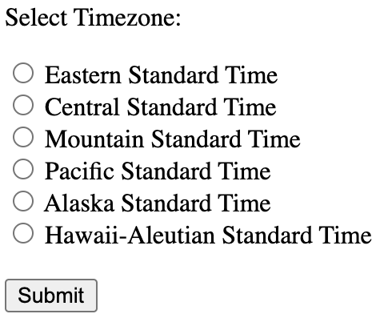

## Task 2: Getting user input with buttons

#### For task 2, we'll go over how to insert a radio button, or an option button, as well as a regular button.

Next, lets set up a form for a user to select their timezone for the clock we're going to build.  To do this, we'll use radio buttons since we want to give the users a few different options to select from, but, we only want to show one time.  Radio buttons are the type of buttons that you'd associate with a multiple choice question - the computer only allows you to select one bullet from a given set.

Radio buttons can be defined using the HTML `input` field if you set the `type` property to `"radio"`.  

The `input` field is defined just like any other tag, with the name of the element and its properties enclosed by less-than and greater-than signs, like so:

`<input [property1]=[value1] [property2]=[value2]>`

However, the input field is special - because it isn't a tag, it doesn't need to be closed (no need for `</input>`).

- In order to let the computer know that these items are in a group, be sure to give each input field the same `name` property (I named mine `"timezone"`). 

- Each item should also have a unique value for the `value` property.

- Once you've set up your input fields, feel free to add some labels and breaks to make your form easier to read. 

  - You can do this by assigning a unique value to the `id` property of your `input` field and then using the `label` tag like so:

    ```{html}
  <label for "[id from input field]"> put your text here</label>
    ```

  - You can also do this by simply putting your text outside of your `input` tag and adding a break(`<br>`) like this:
  
    ```{html}
    <input type="radio" name="tz" value="est"> Eastern Standard Time <br>
    ```

Next, we need to add a submit button.  

- This can be defined using a `button` tag with the` type` property set to `"button"` and `value` property set to `"Submit"`.  
- To add text to your button, add anything you'd like after the definition of the button tag, outside of the angle brackets (<, >). I recommend entering `Submit` for your text.
- Unlike the input field, the button tag does need to be closed so be sure to close it immediately after the text of your buttons. 

Whenever we want to take in some user input involving input fields and a submit button, we want to make sure to group our relevant code in the `form` tag so that the computer knows what to look for.  With that being said, make sure to surround your code related to the input fields and submit button with a form tag.

Finally, add a break and a `div` tag with a unique `id` right below the submit button, outside of the form tag.  We will use this later to print the selected timezone.

By the end of this step, your page should look like this:



#### Open a pull request for your code

Just as you did for the last task, be sure create a new branch, titled `[your GitHub username]-[week]-[task number]`, for your task.  As a reminder my GitHub username is `danzelo1` so my branch name for week 1's second task (this assignment) would be `danzelo1-1-2`.

After you've created your branch, commit your code to this branch and open a pull request to merge with your main branch.  When creating this request, be sure to title it appropriately in accordance with your changes, and include any specific details in your comments.

As long as there are no conflicts with the base branch, you can now merge your pull request with your main branch. From here, click on "Issues" on the top left of your screen, below the name of your repository, and click on the week (so this week would be week 1). A new comment should have appeared for your next task. This is where you'll find the instructions for task 3.