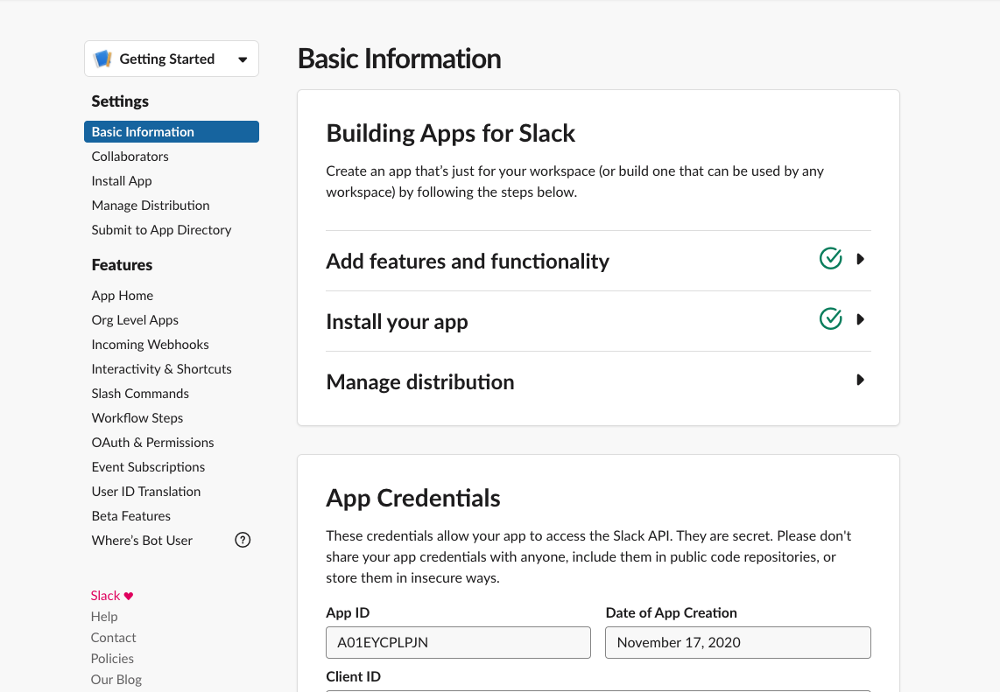
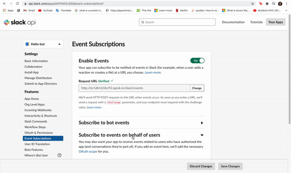

## Config Setup and Event Listeners

#### Setting up a text editor and using event listeners.

Now that you have done some research on Slack development, its time to get building! In this issue, you will learn how to set up a Slack app.

## Installing a Text Editor

Since your slack app will be runing locally, you will need a place to store and edit your code. You can create a folder anywhere within your file system for this project. If you do not have one already, it is highly reccomended that you download an IDE or text editor. This will give you a better interface for when you program, helping you to notice errors and run your code efficiently. Some good editors include [VSCode](https://code.visualstudio.com/download) or [Atom](https://atom.io/).

## Creating a Slack App

In order to create the app, you will need to [create a Slack account](https://slack.com/get-started#/create) and then make a [make a new app](https://api.slack.com/apps?new_app=1) on the developer platform. Once you have made the app, you should be able to click on it and navigate to a page similar to the one below:




## Installing Ngrok

You might be wondering how your local code connects to the slack app. This process happens through a public facing url, or a server connection from your computer to the app. In order to make a public facing url, you first will need to [install ngrok](https://ngrok.com/) , which dedicates a server on your end to receiving requests from the slack app. 

Open a the folder for your slack app in your editor, then open a terminal page. A terminal is a text interface for your computer's operating system. Type in ```pwd``` and press enter to make sure that you have navigated to the folder you created for the slack app. If you have not, refer to [this website](https://medium.com/@grace.m.nolan/terminal-for-beginners-e492ba10902a) on how to change folders. 

Afterwards, refer to the [following tutorial](https://ngrok.com/) on installing ngrok. If you are having trouble with downloading ngrok from the terminal, you can also install it as a package using [this link](https://ngrok.com/download).

## Downloading Slack Packages

Now that you have the basics set up, you need to configure your **local app**. This will involve installing packages from Slack. A package is a bundle of various classes and interfaces that enable you to code without starting from scratch. You can download several packages for anything ranging from sending a text to creating graphs. In this issue, you will be downloading the bolt package, which lets you program a slack app more easily.

In a dedicated folder, call the following command:

```javascript
npm init
```

Click enter for each prompt that pops up, then call **ls** in the terminal to list all of the files in your directory. You should have a new file called **package.json**.

Next, you will be saving your bot token and signing secret as environment variables. This step is *extremely* important for two reasons:

1. telling your local environment which slack app it is connected to
2. ensuring that you don't accidentally show sensitive credentials in a screenshot or distributing code

Call the following commands in your terminal and refer to previous instructions on getting the credentials:

```javascript
export SLACK_SIGNING_SECRET=<your-signing-secret>
export SLACK_BOT_TOKEN=xoxb-<your-bot-token>
```

> Tip: You will have to use these commands often. To save time, copy and paste both of lines with the credentials and save them in a document that you are **not committing**.

Lastly, use the commands to install the **@slack/bolt** package and create your app:

```javascript
npm install @slack/bolt
touch app.js
```

### Access Credentials

The first thing you need to do is link your program to your app! The two pieces of information you'll need to do this are a **slack bot token** and a **slack signing secret**. Both are similar to passwords and make sure only those with the right permissions can make changes to your app. Refer to the gifs below to locate each of these properties from the Slack dashboard:


## Running the App

Now you will need to add some code to your app.js file to know when your app is running. Copy and paste the following code to app.js and then run `node app.js` to run it. There should be a line saying `⚡️ Bolt app is running`:

```javascript
////*********** section 1 *************
const { App } = require('@slack/bolt');

// Initializes your app with your bot token and signing secret
const app = new App({
  token: process.env.SLACK_BOT_TOKEN,
  signingSecret: process.env.SLACK_SIGNING_SECRET
});

//*********** section 2 *************
(async () => {
  // Start your app
  await app.start(process.env.PORT || 3000);

  console.log('⚡️ Bolt app is running!');
})();
```

This first section adds all of the dependencies for your slack app and makes a new app object. The second notifies you that the file is running.

## Connecting to the Slack App

Now that you have installed and ran ngrok, you can connect your local code to your app. Copy the ```forwarding link``` of the running server, then navigate to the ```event subscriptions``` page in your app menu. Enable events, then copy and paste your link in the 'Request URL' field, followed by /slack/events. If your URL is not verified, try running ngrok again and using the new link.


## 🔔 Events

An important part of the app you just built is a **slack event**. Understanding events will be important as we will be using them throughout the bootcamp. Skim through the following articles to learn more about what an event is in programming, how events are used with the Slack Events API, and types of events that you can use in a project:

* https://www.computerhope.com/jargon/e/event.htm

* https://api.slack.com/events-api

* https://api.slack.com/events

  

### Event Subscriptions

You have a connection, but the slack app still does not know what type of information to send you. One type of information is an event, which basically means having your app wait for something specific to happen. In the next issue, you will make a bot that needs to know when someone messages a specific word, like 'hello'. 

Click on 'Subscribe to bot events', and select ```message.channels```, ```message.groups```, ```message.im```, and ```message.mpim```. All of these events listen for a posted message. Click save and then move on:


  

### Scopes

Under OAuth & Permissions, scroll down to the **Bot Token Scopes** field and select **Add an OAuth Scope**. From there, add **chat:write** and install the app to workspace. This will enable your app to write messages in chats.

## Listening for 'Hello'

Now it is time to add some functionality to your bot! Follow [this tutorial](https://slack.dev/bolt-js/tutorial/getting-started#:~:text=%20Getting%20started%20with%20Bolt%20for%20JavaScript%20,handled%2C%20it%E2%80%99s%20time%20to%20set%20up...%20More%20%E2%80%A9http) to build an app that posts a message when someone types 'hello'. Note that you have already completed some of the steps, which we rearranged to make more sense.  Also, the two slack tutorials in the 'events' section can be useful if you need help making sense of some of the code involved.

While you're following the tutorial, write down any questions you have (ie what is this dependency, what is a scope) in a file. Then, research one of those questions and submit a 2-4 sentence summary of your findings as a comment. 

After you have completed the project, try changing what the app listens for (ie instead of "hello" it checks for "bit camp"). See if there is anything you can't listen for as part of a chat. 

## Submission

To move onto the next issue, **commit all of the files/folders dedicated to this app** as well as the **file for your questions** and create a pull request for that commit. Below are the full instructions:

**After you have finished, make sure to commit any file changes you made. To do this, please create a `branch` off of the master called `week(x)` with x being the # of the week you are on. For that week you will need to create a PR for every Learning Lab step to review and make sure your work is correct. For example: After finishing step 1.2, make a new branch off of `week(x)` and call it `week(x)-1.2` (with 1.2 being the step you're on). Then create a `Pull Request` between `week(x)` and `week(x)-1.2`. After reviewing you're PR or having another user review it, merge you're work and continue.**

**REMINDER: If you are part of the MENTORED group, after you complete all steps within a certain week and followed the instructions above, create a `Pull Request` with your work from `week(x)` to `master` and assign your mentor as a reviewer. If you are an open-source user, do the same but self-review your PR to continue to the next week.**
